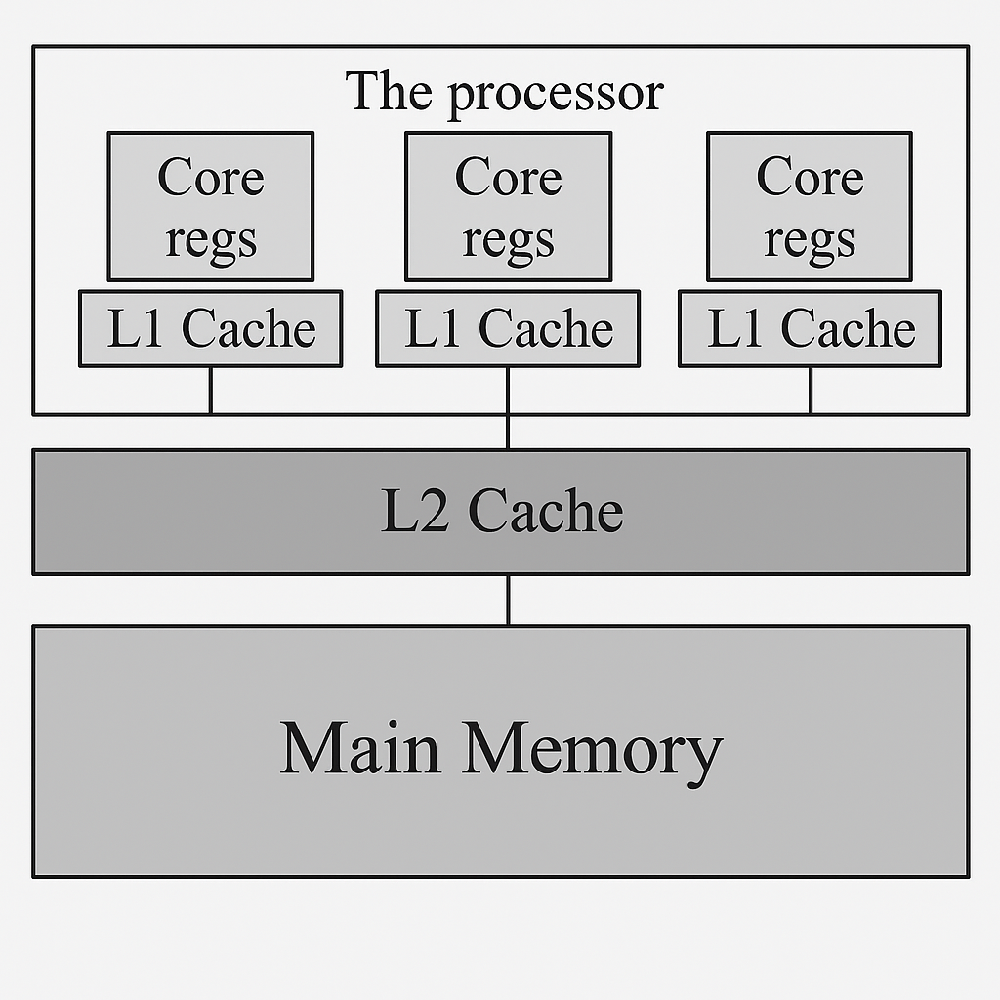
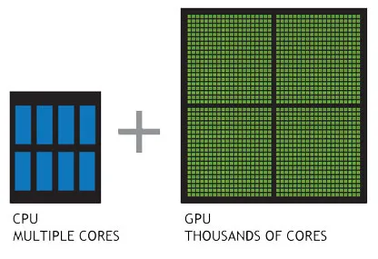

# (Evidencia 4) Detección de Mutaciones en Secuencias con CUDA


Este programa compara dos secuencias (por ejemplo, cadenas de ADN) y detecta las posiciones 
donde existen mutaciones (diferencias) entre la secuencia de entrada y una secuencia de referencia.
Aprovechando el funcionamiento paralelo de CUDA para acelerar el proceso de comparación y conteo de mutaciones,
permitiendo el análisis eficiente de grander volúmenes de datos.


# Memoria constante y jerarquía de caché

## ¿Por qué CUDA?



La imágen muestra como se organiza la memoria en los procesadores modernos,
usando varios niveles de caché para acelear el acceso a los datos.

En la parte superior stán los núcleos del procesador , cada uno con su propia 
caché L1 (la más rápida y pequeña). Todas las cachés L1 se conectan a una caché L2 que es un poco más lenta pero 
mucho más grande. Finalmente debajo de de la caché L2 está la memoria principal o **RAM** que es la más lenta pero 
con mucho mayor capacidad.

La idea es sencilla: cuando el procesador necesita un dato, primero se busca en la caché L1. Si no se encuentra ahí el procesador
va y lo busca en la L2. Si tampoco se encuentra en el caché L2 está en la memoria principal , está tarda más en responder.
Así los datos que se usan más seguido se mantienen cerca del procesador para que todo funcione más rápido.

Ahora, en CUDA la memoria constante aprovecha esta jerarquía: sus datos son guardados en la caché L2, permitiendo que muchos hilos
accedan rápidamente a la misma información de solo lectura , como una tabla o máscara pequeña que todos usan al mismo tiempo. Esto ayuda a que el programa sea más eficiente y rápido, por que reduce el tiempo esperando datos de la **RAM**. **Permitiendo el análisis de datos a gran escala.**

## Implementación

El programa incia leyendo dos archivos de texto: uno con la secuencia modificada y otro con la secuencia de referencia. Cada archivo se lee línea por línea y se concatena todo en una sola cadea.

```c++
// Leer el archivo y almacenar las líneas en un vector
std::vector<std::string> lineas;
std::string linea;
while (std::getline(archivo, linea)) {
    lineas.push_back(linea);
}
archivo.close();

// Concatenar todas las líneas en una sola cadena
std::string concatenado;
for (const auto& l : lineas) {
    concatenado += l;
}
```

Lo mismo se hace con el archivo de referencia.

---

Despúes se reserva memoria tanto en CPU como en la GPU para almacenar las secuencias y el resultado de las mutaciones.

```c++
// Tamaño de la secuencia concatenada
const int n = concatenado.size();

// Reservar memoria en el host (CPU)
char* h_secuencia = concatenado.data();
char* h_referencia = new char[n];
bool* h_mutaciones = new bool[n];

// Copiar la secuencia de referencia al arreglo
for (int i = 0; i < n; ++i) {
    h_referencia[i] = concatenado_referencia[i];
}

// Reservar memoria en el dispositivo (GPU)
char *d_secuencia, *d_referencia;
bool *d_mutaciones;
int *d_contador;
int h_contador = 0;

cudaMalloc(&d_secuencia, n * sizeof(char));
cudaMalloc(&d_referencia, n * sizeof(char));
cudaMalloc(&d_mutaciones, n * sizeof(bool));
cudaMalloc(&d_contador, sizeof(int));

// Copiar datos del host a la GPU
cudaMemcpy(d_secuencia, h_secuencia, n * sizeof(char), cudaMemcpyHostToDevice);
cudaMemcpy(d_referencia, h_referencia, n * sizeof(char), cudaMemcpyHostToDevice);
cudaMemcpy(d_contador, &h_contador, sizeof(int), cudaMemcpyHostToDevice);

```

--- 

Para la parte de que hace la GPU , todo el procesamiento del programa se centra en dos kernels CUDA:

### Comparación de secuencias
Cada hilo compara una posición de ambas secuencis y marca si hay una mutación.

```c++
__global__ void buscarMutaciones(char* secuencia, char* referencia, bool* mutaciones, int longitud) {
    int idx = blockIdx.x * blockDim.x + threadIdx.x;
    if (idx < longitud) {
        mutaciones[idx] = (secuencia[idx] != referencia[idx]);
    }
}
```

El kernel es lanzado en esta parte:

```c++
const int blockSize = 256;
const int gridSize = (n + blockSize - 1) / blockSize;
buscarMutaciones<<<gridSize, blockSize>>>(d_secuencia, d_referencia, d_mutaciones, n);
cudaDeviceSynchronize();
```

### Conteo e impresión de mutaciones
Se recorre el arreglo de mutaciones y si hay una se imprime la posición y se suma al contador.

```C++
__global__ void imprimirYContarMutaciones(bool* mutaciones, int longitud, int* contador) {
    int idx = blockIdx.x * blockDim.x + threadIdx.x;
    if (idx < longitud && mutaciones[idx]) {
        printf("Mutación en la posición %d\n", idx);
        atomicAdd(contador, 1);
    }
}
```

EL kernel es lanzado en esta parte:

```c++
imprimirYContarMutaciones<<<gridSize, blockSize>>>(d_mutaciones, n, d_contador);
cudaDeviceSynchronize();
```

---

### Recuperación e impresión de resultados

El resultado final , es decir , el número total de mutaciones se copia de la GPU a la CPU y se imprime:
```c++
cudaMemcpy(&h_contador, d_contador, sizeof(int), cudaMemcpyDeviceToHost);
std::cout << "\nTotal mutaciones: " << h_contador << std::endl;
```

---

### Liberación de memoria

Finalmente se libera la memoria:

```c++
delete[] h_referencia;
delete[] h_mutaciones;
cudaFree(d_secuencia);
cudaFree(d_referencia);
cudaFree(d_mutaciones);
cudaFree(d_contador);
```

--- 

### Resumen de flujo

1. Leer y concatenar archivos de entrada.
2. Reservar y copiar memoria en CPU y GPU.
3. Lanzar kernels para buscar y contar mutaciones.
4. Recuperar e imprimir el total de mutaciones.

---

# ¿Por qué no usar solo la CPU?

EL programa compara dos secuencias largas (de alrededor de 1,000,000,000 de registros), posición por posición para detectar mutaciones, Aunque esto puede hacerse en CPU, existen varias razones por las que una GPU y CUDA son mucho más eficientes para este tipo de tareas:

- **Paralelismo**

Las CPU's modernas suelen tener entre 4 y 16 núcleos (entre 4 - 32 hilos), capaces de ejecutar solo unos pocos hilos en paralelo, las GPU's en cambio pueden tener miles de núcleos (en mi caso con una rtx 4060 de laptop 3072 o de 12,288 hilos a 30,720) permitiendo procesar miles de posiciones de la secuencia al mismo tiempo.

Comparar los datos anteriores únicamente muestra una diferencia abismal!

- **Ancho de banda de la memoria**

Las GPU's tienen un ancho de banda de memoria mucho mayor que las CPU's, lo que significa que pueden transferir y procesar grandes cantidades de datos mucho más rápido. Por ejemplo , en tareas como la comparación de secuencias, donde se leen y escriben millones de datos , este ancho de banda es clave para la velocidad.

- **Acceso a la memoria**

Las CPU's tienen cachés grandes (L1,L2,L3) y complejos y al momento de compartir datos entre núcleos implica pasar por varios niveles de caché lo que simplemente genera demoras y no es apropiado, en cambio las GPU's los datos pasan de más rápido a través de la RAM y la caché L2 lo que figurativamente reduce la latencia cuando muchos hilos acceden a los mismos datos.

## Ejemplo

En el mismo main , despúes de prepara los datos , lanzamos un kernel para comparar todas las posiciones en paralelo: 

```c++
const int blockSize = 256;
const int gridSize = (n + blockSize - 1) / blockSize;
buscarMutaciones<<<gridSize, blockSize>>>(d_secuencia, d_referencia, d_mutaciones, n);
```

En CPU implicaría un bucle secuencal o en el mejor d elos casos , un paralelismo muy limitado.




# Análisis Temporal y espacial

Para esta implementación la comparación de la secuencia de tamaño n (alrededor de 300 millones registros) , la carga de trabajo es serada entre miles núcleos entonces ¿Cómo medimos esto?

## Complejidad temproal

En teoría la complejidad es O(n) ya que estamos analizando n cantidad de datos. Sin embargo dado a que los hilos trabajan en paralelo el tiempo de ejecución se reduce a O(n / núcleos). Aunque tengamos un número establecido de registros el tiempo disminuye ya que al estar trabajando de una manera no lineal y repartida los datos son procesados más rápidos.

O(300,000,000 / 3072) = O(97,656) , cada núcleo procesa aproximadamente 97,656 comparaciones en serie , pero al ejecutar todas al mismo tiempo , es mucho más rápido.

## Complejidad espacial

Se necesita memoria para:

- Secuencia modificada O(n)
- Secuencia de referencia O(n)
- Arreglo de mutaciones O(n)

Total: O(n)

# Tests

He diseñado dos tests para la demostración de que CUDA es el lenguaje más apropiado para este proyecto:

1. Comparación de tiempos: main.cpp (CPU) vs main.cu (CUDA)

Como pueden notar, existe un archivo main.cpp y otro main.cu. He decidido fortalecer mi punto sobre por qué CUDA es preferible frente a la CPU midiendo los tiempos de ejecución en ambos enfoques.

Estos son los resultados de las pruebas , hay que tomar en cuenta que depende mucho de los núcleos de cada gráfica y el tiempo puede variar. En este caso estoy uando una 4060 con 3072 núcleos y estaremos analizando alrededor de 300 millones de registros.

CUDA: 2.44 segundos

CPU: 33.17 segundos

Es una diferencia abismal! Esta prueba puede ser realizada con el archivo genoma.txt y g1.txt.

2. Prueba del programa

Para finalizar, se realizó una prueba ejecutando directamente el archivo main.cu, que es el núcleo del proyecto y contiene la lógica CUDA para la detección de mutaciones en secuencias.

La ejecución del programa se realiza con dos archivos de entrada, por ejemplo: genoma.txt y g1.txt. El comando típico para compilar y ejecutar el programa CUDA es:

> nvcc -o detectar_mutaciones main.cu
> ./detectar_mutaciones g1.txt genoma.txt

> [!WARNING]  
> Por limitaciones de github y el tamaño de los archivos (más de 100mb) g1.txt y genoma.txt fueron movidos al siguiente drive: [Link al drive](https://drive.google.com/drive/folders/1XmUEJO-0LU1OERmWRpafIOffZhYCkaaU?usp=sharing)

# Bibliografías

> Atomic Operations in CUDA. (2020, 18 mayo). 靡不有初 鲜克有终. https://huangzhiyuan.github.io/2020/05/18/atomic-operations/index.html

> Hwu, W. W., Kirk, D. B., & El Hajj, I. (2023). Programming Massively Parallel Processors: A Hands-on Approach (4th ed.). Morgan Kaufmann.

>Pacheco Bautista, R., González Martínez, A., & Trejo Ramírez, J. A. (2015). De la secuenciación a la aceleración hardware de los programas de alineación de ADN, una revisión integral. Revista Mexicana de Ingenieria Biomedica, 36(3), 259-274. https://www.scielo.org.mx/pdf/rmib/v36n3/v36n3a10.pdf

> Felix-Rojas. (s. f.). GitHub - felix-rojas/2Dconvolution: Convolutions on a 2D array using CUDA. GitHub. https://github.com/felix-rojas/2Dconvolution
> Creo el mejor repositorio que he visitado.